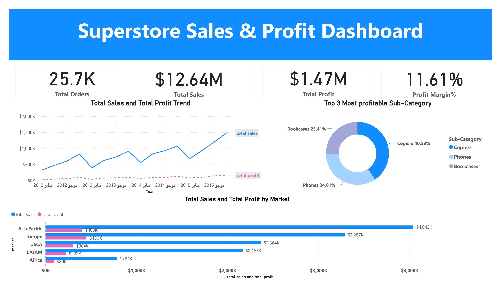
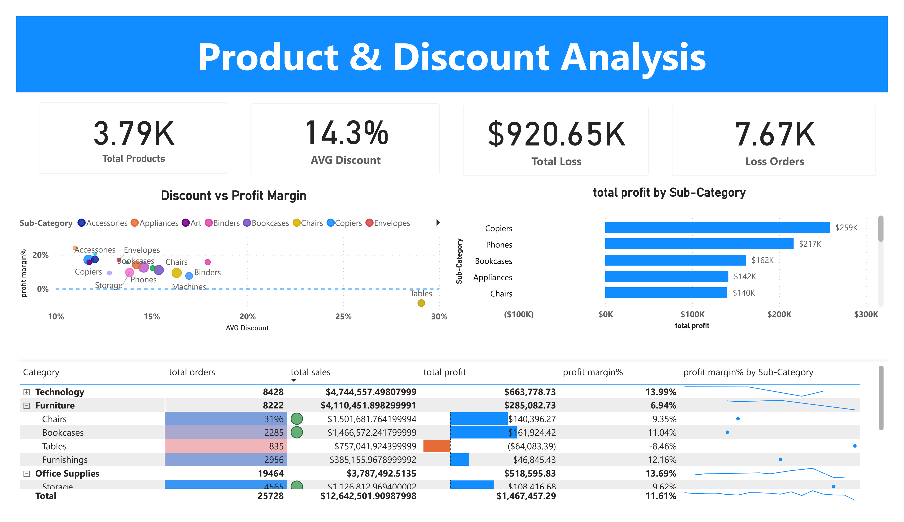
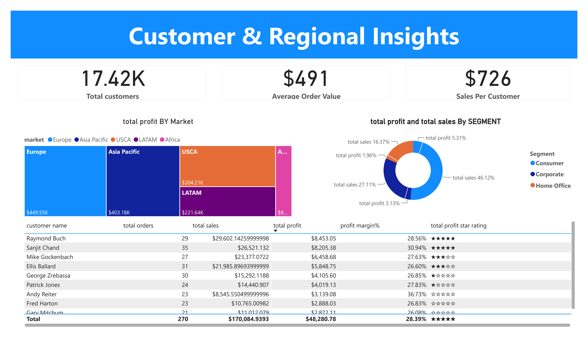

# Superstore Sales & Profit Analysis

An end-to-end business intelligence project transforming raw transactional retail data into an actionable 3-page interactive Power BI dashboard, powered by SQL data pipelines, Star Schema dimensional modeling, and DAX metrics.

## Overview

This project analyzes global Superstore sales data to uncover insights on profitability, discounting behavior, and customer/regional performance. The workflow covers the full analytics pipeline: raw data cleaning in MySQL, dimensional modeling in Power Query, and an interactive dashboard built with DAX measures.

## Tools Used

- **MySQL** — data staging, cleaning, and exploratory analysis
- **Power Query (M)** — dimensional modeling and calendar table generation
- **Power BI / DAX** — data modeling, measures, and dashboard visuals

## Project Workflow

1. **Data Cleaning (SQL)** — staged the raw dataset, checked for duplicates and null values, standardized date formats, and trimmed whitespace across text fields.
2. **Exploratory Data Analysis (SQL)** — analyzed overall KPIs, monthly trends, category/sub-category performance, discount impact on profitability, and top customers by profit.
3. **Data Modeling (Power BI)** — decomposed the cleaned dataset into a Star Schema with one fact table and five dimension tables for optimal DAX performance.
4. **Dashboard Design (Power BI)** — built a 3-page interactive report with KPI cards, trend charts, and detailed breakdown tables.

## Dashboard Preview

### Sales & Profit Overview


### Product & Discount Analysis


### Customer & Regional Insights


## Data Model

The dashboard is built on a Star Schema with one fact table (`Fact Sales`) and five dimension tables (Customer, Product, Orders, Order Date, Ship Date), designed for optimal DAX performance.

📄 [View full data model documentation](docs/data_model.md)

## Key Insights

- Total sales of **$12.64M** with an overall profit margin of **11.61%**
- **Copiers** is the most profitable sub-category, contributing over 40% of top-3 sub-category profit
- Higher discount levels show a clear negative correlation with profit margin, with some sub-categories (e.g., Tables) operating at a loss
- **Europe** and **Asia Pacific** are the top-performing markets by both sales and profit

## Repository Structure

```
superstore-sales-profit-analysis/
├── data/           # Raw and cleaned datasets
├── sql/            # Data cleaning and EDA scripts
├── power_bi/       # Power BI dashboard file (.pbix)
├── assets/         # Dashboard screenshots and model diagram
├── docs/           # Extended documentation (data model)
└── README.md
```

## License

This project is licensed under the Apache License 2.0 — see the [LICENSE](LICENSE) file for details.
